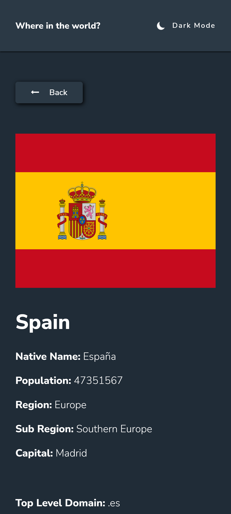

# Frontend Mentor - REST Countries API with color theme switcher solution

This is a solution to the [REST Countries API with color theme switcher challenge on Frontend Mentor](https://www.frontendmentor.io/challenges/rest-countries-api-with-color-theme-switcher-5cacc469fec04111f7b848ca). Frontend Mentor challenges help you improve your coding skills by building realistic projects. 

## Table of contents

- [Overview](#overview)
  - [The challenge](#the-challenge)
  - [Screenshot](#screenshot)
  - [Links](#links)
- [My process](#my-process)
  - [Built with](#built-with)
  - [What I learned](#what-i-learned)
  - [Useful resources](#useful-resources)
- [Author](#author)

## Overview

### The challenge

Users should be able to:

- See all countries from the API on the homepage
- Search for a country using an `input` field
- Filter countries by region
- Click on a country to see more detailed information on a separate page
- Click through to the border countries on the detail page
- Toggle the color scheme between light and dark mode *(optional)*

### Screenshot





### Links

- Solution URL: [code](https://github.com/alexgcode/rest-api-countries-frontendmentor)
- Live Site URL: [live](https://alexgcode.github.io/rest-api-countries-frontendmentor)

## My process

### Built with

- Semantic HTML5 markup
- CSS custom properties
- Flexbox
- CSS Grid (for country cards layout)
- Desktop-first workflow
- vanilla Javascript
- [Sass](https://sass-lang.com/) - css pre processor

### What I learned

Remember how to pass data between 2 different pages with js using get parameters

Use of filter(a js array property) with include to create a search name input.

Use of this css trick to make the grid responsive
```css
repeat(auto-fit, minmax(min(100%,200px),1fr)); 
```

Adding an observer to detect changes in the dom.


### Useful resources
- fetch to api call (https://www.youtube.com/watch?v=uxf0--uiX0I&ab_channel=TheCodingTrain)
- how to use localstorasge (https://www.youtube.com/watch?v=F6j_V6FUYTI&ab_channel=hdeleon.net)
- toggle css class with js (https://www.javascripttutorial.net/javascript-dom/javascript-classlist/)
- back button (https://www.w3schools.com/jsref/met_his_back.asp)
- darkmode loading css file with js (https://www.youtube.com/watch?v=Jgx5hSoogMw&ab_channel=AlejandroMagnitopic)
- change root variable with js (https://www.w3schools.com/css/css3_variables_javascript.asp)
- multiple calls in a loop (https://stackoverflow.com/questions/37576685/using-async-await-with-a-foreach-loop)
- run js when dom is load (https://www.devdungeon.com/content/run-javascript-after-dom-fully-loaded)
- hide scrollbars but keep functionality (https://www.w3schools.com/howto/howto_css_hide_scrollbars.asp)
- validator of html markups (https://validator.w3.org/#validate_by_input+with_options)
- use of observer to detect changes in the DOM (https://developer.mozilla.org/en-US/docs/Web/API/MutationObserver)
- custom dropdown https://codepen.io/RajRajeshDn/pen/XWJYMzZ (https://codepen.io/STKNG/pen/GbVogZ)


## Author

- Website - [alexgfcode](http://alexgfcode.me/)
- Frontend Mentor - [@alexgcode](https://www.frontendmentor.io/profile/alexgcode)
- linkedin - [@alexgarcia](https://www.linkedin.com/in/alex-martin-garcia-farfan/)
